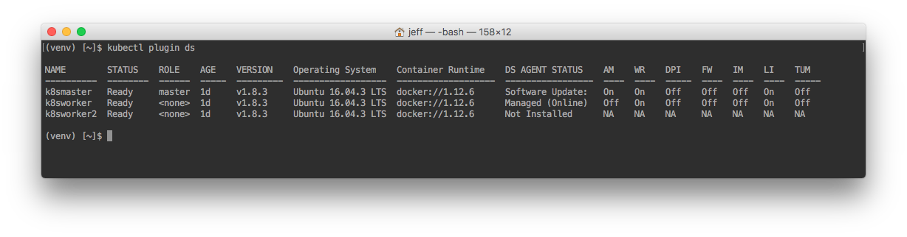

Deep Security Kubernetes (kubectl) Plugin
====

## Installation
1. clone repo to your ~/.kube/plugins directory
2. pip install -r requirements.txt
3. Create a Kubernetes secret called deepsecurity with your base64 encoded password.
   A sample secret.yaml file is included. kubectl apply -f secret.yaml
4. Enter your DS information in config.yaml

## Usage
Commands: 
    create_connector  'name' creates a k8s connector in the dsm 
    status            displays cluster status  

kubectl plugin ds status 
kubectl plugin ds create_connector "myk8sconnector" 

#sample output

